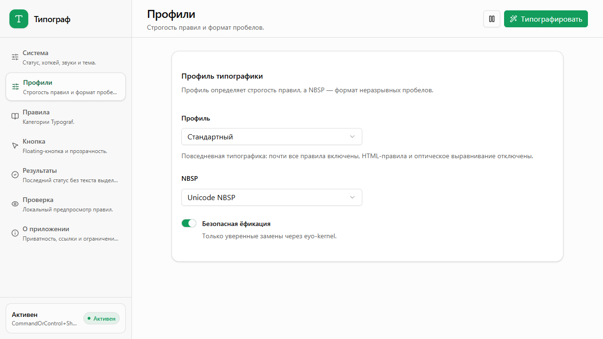
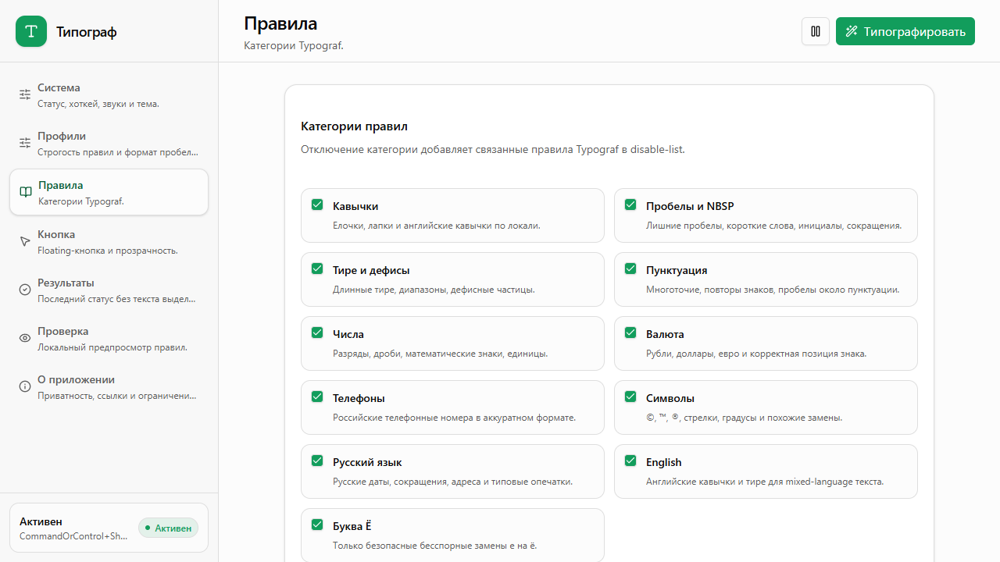
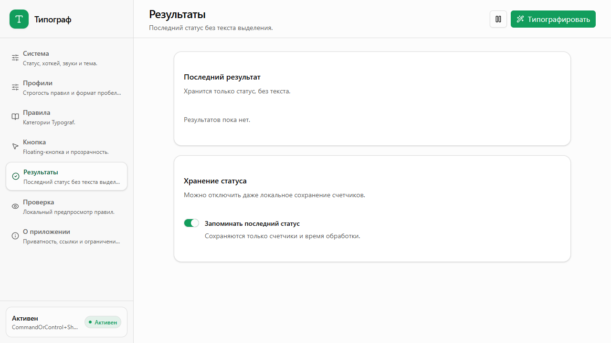

# FreeTypograf

Локальный desktop-типограф для Windows и macOS.

FreeTypograf помогает быстро привести выделенный текст к аккуратной типографике: кавычки, тире, пробелы, NBSP, даты, числа, телефоны, валюты и безопасная ёфикация. Пользователь выделяет текст в любом приложении, нажимает floating-кнопку или хоткей, результат вставляется обратно как plain text.

## Privacy First

- Текст обрабатывается только локально на компьютере.
- Содержимое выделения и clipboard не отправляется во внешние API.
- В логи и настройки не записывается пользовательский текст.
- В MVP сохраняются только локальные счетчики результата, если это включено в настройках.

## Download

Готовые сборки публикуются в [GitHub Releases](https://github.com/Nefedorb/freetypograf/releases).

Для тестовых сборок без релиза можно скачать artifacts из вкладки [Actions](https://github.com/Nefedorb/freetypograf/actions).

## Скриншоты

| Профили | Правила | Результаты |
| --- | --- | --- |
|  |  |  |

## Windows

1. Откройте последний Release.
2. Скачайте Windows installer: `.msi` или `setup.exe`.
3. Установите приложение и запустите FreeTypograf.
4. Проверьте tray-меню, floating-кнопку и хоткей `CommandOrControl+Shift+T`.

Текущие сборки не подписаны code signing certificate, поэтому Windows может показать предупреждение SmartScreen. Для закрытого теста это ожидаемо.

Подробный чеклист: [docs/WINDOWS_TESTING.md](docs/WINDOWS_TESTING.md).

## macOS

1. Откройте последний Release.
2. Скачайте `.dmg`.
3. Откройте приложение через правый клик -> **Open**, потому что тестовая сборка пока unsigned.
4. Выдайте Accessibility permission: **System Settings** -> **Privacy & Security** -> **Accessibility**.

Accessibility нужен только для отправки `Command+C` и `Command+V` по явному действию пользователя.

Подробный чеклист: [docs/MACOS_TESTING.md](docs/MACOS_TESTING.md).

## Локальная разработка

```bash
pnpm install
pnpm dev
```

Проверки:

```bash
pnpm typecheck
pnpm test
pnpm build
```

Desktop-сборка:

```bash
pnpm tauri build
```

## Release Process

Порядок сборки и публикации описан в [docs/RELEASE_PROCESS.md](docs/RELEASE_PROCESS.md).

Коротко:

1. Обновить версии в `package.json` и `src-tauri/tauri.conf.json`.
2. Пройти локальные проверки.
3. Создать тег `v0.1.0-test` или другой version tag.
4. Запушить тег.
5. GitHub Actions соберёт Windows и macOS и создаст Release.

## Технологии

- Tauri 2
- Next.js static export
- shadcn/ui + Tailwind
- `typograf@7.7.0`
- `eyo-kernel@4.1.2`
